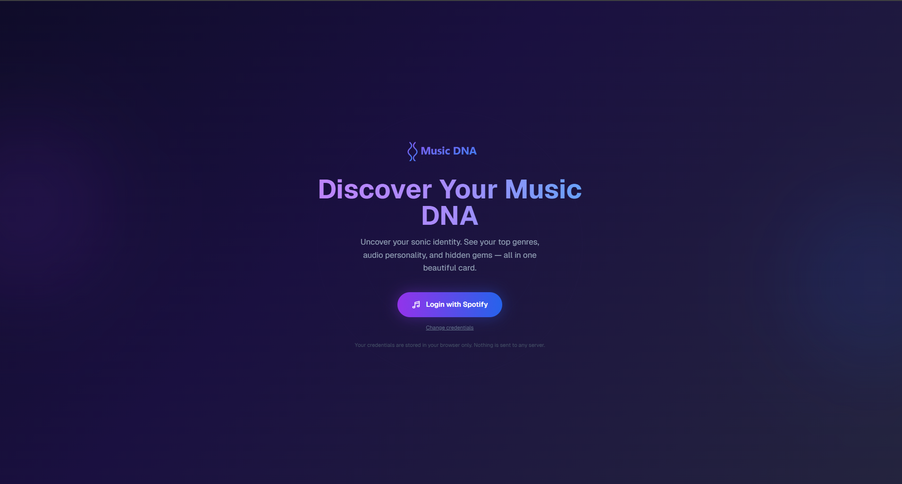
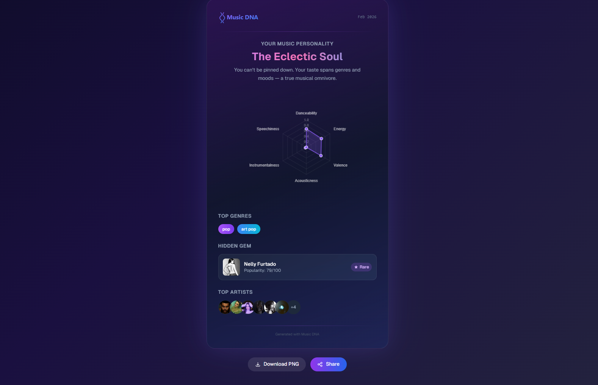
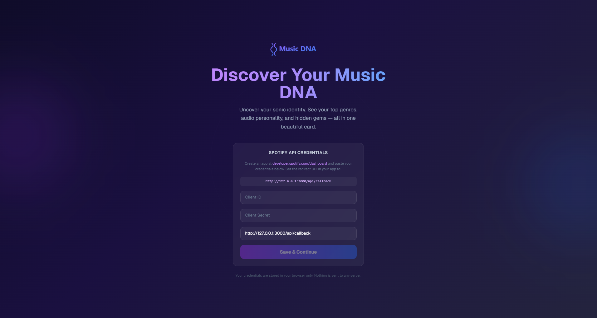
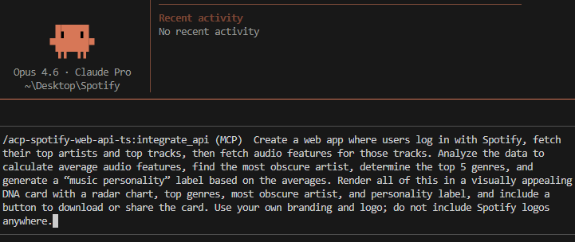

# Spotify Web API Sample Application

A personalized Music DNA card generator that analyzes your Spotify listening history to reveal your audio personality, top genres, radar chart of audio features, and hidden gem artists — all in one shareable card.

This application was built using an SDK generated by [APIMatic](https://www.apimatic.io/). The Spotify Web API SDK was generated through APIMatic's code generation engine. You can explore the full API portal [here](https://www.apimatic.io/apidocs/spotify-web-api).

## Demo





## Features

- **Music Personality Analysis** — Get a unique personality label (e.g., "Eclectic Soul", "Rhythm Explorer") based on your listening patterns
- **Audio DNA Radar Chart** — Visualize your music profile across six dimensions: Danceability, Energy, Valence, Acousticness, Instrumentalness, and Speechiness
- **Top Genres Discovery** — See your most-listened genres displayed as colorful badges
- **Hidden Gem Artist** — Find your most obscure artist pick that sets you apart
- **Shareable PNG Card** — Download or share your Music DNA card as a beautiful image
- **Secure OAuth Flow** — Authenticate with Spotify using your own API credentials stored only in your browser

## Quick Start

### Prerequisites

- [Spotify Developer Account](https://developer.spotify.com/dashboard) — Create an app to get your Client ID and Client Secret
- [Node.js 18+](https://nodejs.org/)
- Git

### Installation

```bash
# Clone the repository
git clone https://github.com/apimatic/PaypalSampleApp.git
cd PaypalSampleApp

# Install dependencies
npm install

# Run the app
npm run dev
```

Open [http://localhost:3000](http://localhost:3000) in your browser. Enter your Spotify API credentials (Client ID, Client Secret, and Redirect URI) on the home page, then click **Login with Spotify** to generate your Music DNA card.



> **Note:** In your Spotify Developer Dashboard, add your redirect URI (shown on the app's home page) to your app's Redirect URI settings.

## How It Works

The app authenticates with Spotify using the Authorization Code OAuth flow. When a user logs in, the app exchanges the authorization code for an access token, which is stored as an HTTP-only cookie for the session.

Once authenticated, the app fetches the user's top 50 artists and top 50 tracks (medium-term) using the APIMatic-generated Spotify SDK. It then retrieves audio features (danceability, energy, valence, etc.) for all tracks using batch requests. These raw data points are averaged and analyzed to produce a personality label, genre rankings, and an obscurity score for each artist.

The results are rendered into a visually rich card component. The radar chart is built with Chart.js, and the entire card can be captured as a PNG using html2canvas for downloading or sharing via the Web Share API.

## AI Generation Details

This application was generated using **Claude Code** with the **APIMatic MCP Server** context plugin for the Spotify Web API SDK.

### Prompt Used



### Time Investment

| Phase | Duration |
|-------|----------|
| Initial generation | ~15 minutes |
| Testing and iteration | ~45 minutes |
| **Total** | **~1 hour** |

## Tech Stack

| Layer | Technology |
|-------|-----------|
| Frontend | Next.js 14 (App Router), React, Tailwind CSS |
| Backend | Next.js API Routes (Node.js) |
| API Client | [APIMatic-generated Spotify Web API SDK](https://www.apimatic.io/apidocs/spotify-web-api) (`spotify-apimatic-sdk`) |
| Charts | Chart.js + react-chartjs-2 |
| Image Export | html2canvas |
| AI Assistant | Claude Code with APIMatic MCP Server |

## Resources

- [APIMatic Portal for Spotify Web API](https://www.apimatic.io/apidocs/spotify-web-api)
- [Spotify Developer Dashboard](https://developer.spotify.com/dashboard)
- [APIMatic Code Generation](https://www.apimatic.io/)
